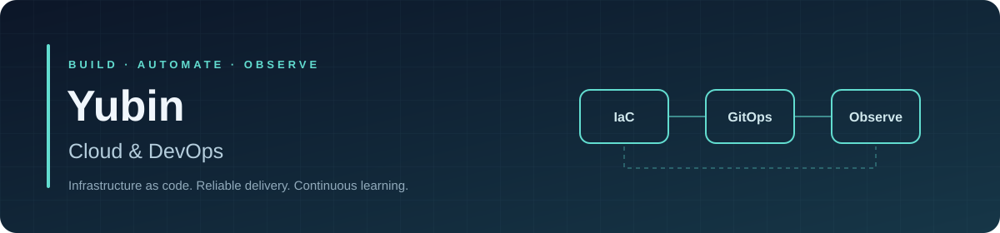

### 인프라를 코드로 만들고, 배포와 운영을 연결합니다.

안녕하세요, **김유빈**입니다. Unity/C# 게임 클라이언트 개발 경험을 바탕으로 **Cloud · DevOps 엔지니어**로 전환하고 있습니다.

Terraform으로 인프라를 구성하고, CI/CD와 모니터링을 연결하며, 장애와 부하 상황에서 시스템의 동작을 확인합니다. 구현 과정의 문제와 해결 방법도 함께 기록합니다.

`AWS` · `Azure` · `Terraform` · `Kubernetes` · `GitOps`

  
  

### Languages & tools

### GitHub activity

  
  

활동 카드는 외부 서비스가 집계하며 GitHub 기여 그래프와 집계 기준이 다를 수 있습니다.

---

### Selected projects

#### ☸️ EKS · GitOps 파이프라인 — 개인 프로젝트

[인프라 코드](https://github.com/yubin05/eks-infra) · [애플리케이션 코드](https://github.com/yubin05/eks-app)

- Terraform으로 EKS를 구성하고, 애플리케이션과 인프라 저장소를 분리했습니다.
- GitHub Actions → ECR → 매니페스트 갱신 → Argo CD → EKS로 이어지는 배포 흐름을 구현했습니다.
- Prometheus·Grafana·CloudWatch로 상태를 관찰하고, k6 부하 테스트에서 HPA의 **Pod 2 → 6 확장**을 확인했습니다.

EKS 배포 흐름 보기

[서비스 연결과 백엔드 요청 흐름 자세히 보기](https://github.com/yubin05/eks-infra#아키텍처)

문제를 해결하며 배운 것

ALB Controller와 CloudWatch Agent의 자격증명 조회 실패를 조사하면서, 공통 원인이 노드의 IMDS hop limit 설정임을 확인했습니다. 반복되는 증상을 노드 구성 수준에서 해결하는 경험을 했습니다.

#### ☁️ AWS–Azure 멀티클라우드 DR — 팀 프로젝트

[프로젝트 코드](https://github.com/yubin05/Project_TEAM_AWS)

- 4인 팀의 팀장으로 **DR·멀티클라우드 인프라·AWS CI/CD**를 담당했습니다.
- Terraform과 Route 53을 이용해 AWS Active / Azure Passive 전환 구조를 구성했습니다.
- S3–Blob 이벤트 기반 이미지 동기화와 ECS Blue/Green 배포 파이프라인을 구현했습니다.
- DMS CDC 복제 방향과 가이드를 설계하고, 구현은 담당 팀원과 협업했습니다.

AWS–Azure DR 구성 보기

[전체 아키텍처와 데이터 동기화](https://github.com/yubin05/Project_TEAM_AWS#멀티클라우드-dr-구성)

#### 🛡️ Security agent toolkit — 학습 프로젝트

[실습 코드와 학습 기록](https://github.com/yubin05/security-agent-toolkit)

Python으로 로그 정규화·탐지 룰·웹훅·LLM 요약·도구 라우팅을 학습하고 있습니다. 경보의 누락과 중복을 확인하고, 사람이 검토할 수 있는 결과를 만드는 과정을 연습합니다.

---

### Tools I work with

| 분야 | 기술 |
| :--- | :--- |
| Cloud | AWS · Azure |
| Infrastructure as code | Terraform · CloudFormation |
| Containers | Docker · Kubernetes / EKS · ECS Fargate |
| Delivery | GitHub Actions · Argo CD · CodePipeline / CodeBuild / CodeDeploy |
| Observability | CloudWatch · Prometheus · Grafana · k6 |
| Languages & scripting | Python · Bash · C# |

### Background

- Unity/C# 게임 클라이언트 개발 약 1.5년
- 클라우드 DevOps 부트캠프 수료
- AWS Certified Solutions Architect – Associate · 리눅스마스터 2급 · 정보처리기사

코드와 실험 결과, 그리고 그 과정에서 배운 것을 남깁니다.
